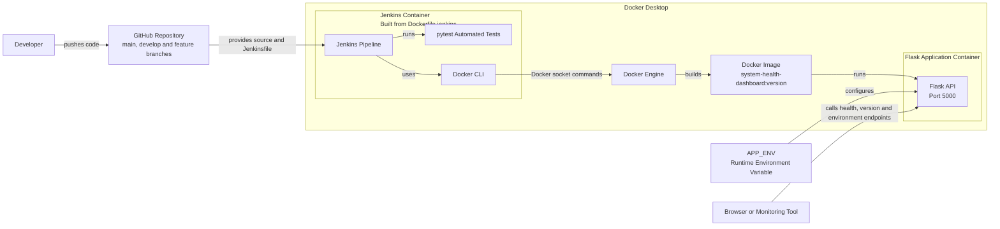

A small Flask API that reports application health, version, and environment. Built as a Git and DevOps mini project to demonstrate automated testing, Docker containerisation, and a Jenkins CI pipeline.

## Endpoints

| Endpoint | Purpose | Example response |
| --- | --- | --- |
| `/health` | Confirms the application is running | `{"status":"UP"}` |
| `/version` | Shows the application version | `{"version":"1.0.0"}` |
| `/environment` | Shows the value of the `APP_ENV` environment variable | `{"environment":"development"}` |

## Project structure

```text
.
├── app.py                 # Flask application and API endpoints
├── requirements.txt       # Python dependencies
├── tests/
│   └── test_app.py        # Automated endpoint tests
├── Dockerfile             # Application container image definition
├── Dockerfile.jenkins     # Custom Jenkins image with Docker + Python preinstalled
├── Jenkinsfile            # Jenkins pipeline stages
├── .gitignore              # Files Git should not commit
└── .dockerignore           # Files Docker should not copy into the image
```

## Project Architecture



## Prerequisites

- Python 3.11 or later
- Docker Desktop (only required for the Docker section)
- Jenkins with Docker access (only required for the Jenkins section)

## Run locally

1. Clone the repository and move into the project folder:

```bash
   git clone <your-repo-url>
   cd system-health-dashboard
```

2. Create a virtual environment the first time you set up the project:

```bash
   python -m venv .venv
```

3. Activate it:

   **Windows (PowerShell):**
```powershell
   .\.venv\Scripts\Activate.ps1
```
   If PowerShell blocks this command, run the following once for the current terminal and try again:
```powershell
   Set-ExecutionPolicy -Scope Process -ExecutionPolicy Bypass
```

   **macOS / Linux:**
```bash
   source .venv/bin/activate
```

4. Install dependencies:

```bash
   pip install -r requirements.txt
```

5. Start the API:

```bash
   python app.py
```

The application runs at `http://localhost:5000`. Stop it with `Ctrl + C`.

## Verify the API

With the app running, open these URLs in a browser:

- `http://localhost:5000/health`
- `http://localhost:5000/version`
- `http://localhost:5000/environment`

The `/environment` endpoint returns `development` unless `APP_ENV` is set.

To run the app with a different environment:

**PowerShell:**
```powershell
$env:APP_ENV = "testing"
python app.py
```

**macOS / Linux:**
```bash
export APP_ENV=testing
python app.py
```

Then `/environment` returns:

```json
{"environment":"testing"}
```

## Run automated tests

From the project folder, with the virtual environment active:

```bash
python -m pytest -v
```

The suite checks all three endpoints. A non-zero exit code means at least one test failed — Jenkins uses this to stop the pipeline before a faulty image is built.

## Build and run with Docker

1. Build a versioned image:

```bash
   docker build -t system-health-dashboard:1.0.0 .
```

2. Run it and supply the environment as a runtime variable:

```bash
   docker run --rm -p 5000:5000 -e APP_ENV=production system-health-dashboard:1.0.0
```

3. Verify `/health`, `/version`, and `/environment` at `http://localhost:5000`.

Use `Ctrl + C` to stop the container. The `--rm` flag removes the stopped container automatically.

## Jenkins pipeline

The `Jenkinsfile` defines these stages:

```text
Checkout → Install → Test → Build → Tag → Health check
```

- **Checkout** — pulls the project source.
- **Install** — installs Python dependencies (`Flask`, `pytest`).
- **Test** — runs `pytest -v`; a failure stops the pipeline.
- **Build** — builds the Docker image, tagged `latest`.
- **Tag** — adds Jenkins' unique `BUILD_NUMBER`, e.g. `system-health-dashboard:12`.
- **Health check** — starts a temporary container, calls `/health`, then removes the container.

`Dockerfile.jenkins` defines a custom Jenkins agent image (based on `jenkins/jenkins:lts`) with Docker and Python/pip preinstalled, so the pipeline above can build images and run tests without extra manual setup.

Before running this pipeline, ensure the Jenkins agent can run `python3`, `pip3`, `pytest`, `docker`, and `curl`.

## Git workflow used

```text
main → develop → feature/api-endpoints and feature/tests
```

Feature work was completed in focused branches and merged into `develop`. A README merge conflict was resolved and recorded in the commit history. The intended final workflow is a reviewed pull request from `develop` to `main`.

## Future Improvements
- **Monitoring** — expose a `/metrics` endpoint and use Prometheus + Grafana for uptime, latency, and request-rate dashboards.
- **Docker** — multi-stage build, non-root user, `HEALTHCHECK` instruction.
- **CI/CD (Jenkins)** — proper `checkout scm`, push images to a registry, rollback on failed health check.
- **Deployment** — `docker-compose.yml` for local setup, environment-specific configs.
- **Documentation** — badges, diagrams as repo images, `CONTRIBUTING.md`.
